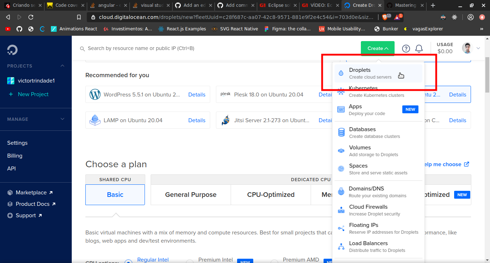
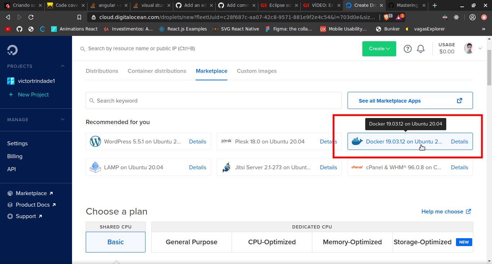
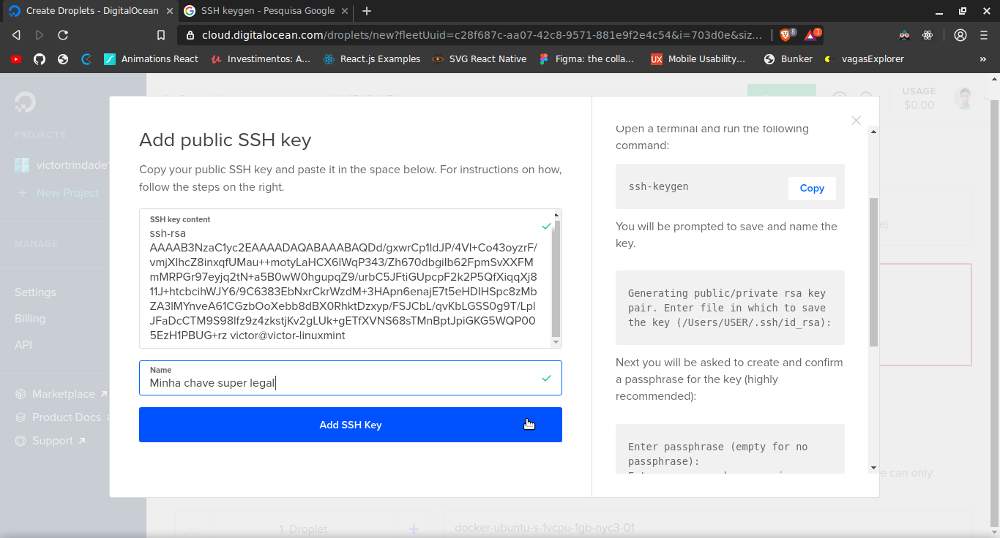

# Criando servidor

O curso recomenda iniciantes usarem o servidor da Digital Ocean, por ter preços
bem definidos e vc paga mais barato em projetos menores. Vc aluga um Linux cru,
apenas com o Docker e Docker Compose nele, e o menor valor é US$ 5,00/mês, pra
um pc linux com 1GB de RAM, SSD de 25GB e 1TB de transferência.

Outros servidores:

- Azure
- AWS
- Heroku

Para criar um servidor na Digital Ocean, crie um novo `Droplet`:

Em vez de selecionar Ubuntu de vez, vá em `Marketplace` e selecione o
`Docker on Ubuntu`.

Escolha o plano q quer pagar (US$5) e o local do datacenter (NY).

## SSH Key

Vc pode logar por senha, ou usar SSH. A SSH é gratuita, mais segura e mais
recomendada de usar. São 2 arquivos gerados pelo comando `ssh-keygen`:

- id_rsa
- id_rsa.pub

No `id_rsa.pub` está o hash q vc usará no servidor.

Também é gerado um `fingerprint`, q é um desenho randômico. Este não é um
arquivo, porém algumas plataformas como o Github pedem. Este, pode ser gerado a
qqr momento com o comando `ssh-keygen -lf (path até .ssh)/.ssh/id_dsa.pub`

### Gerar uma nova SSH Key: ssh-keygen

> ssh-keygen não funciona no Ruindows. Se tiver Ruindows use PuTTY

Antes, crie uma pasta `.ssh` onde vc quer guardar a key.

No terminal: `ssh-keygen`

"Enter file in which to save the key (/home/victor/.ssh/id_rsa):"

Coloque o path de .ssh: `/home/victor/documentos/node/.ssh/id_rsa`

"Enter passphrase (empty for no passphrase):"

Para mais segurança, vc pode colocar senha. Assim, msm o SSH sabendo seu pc, se
vc é invadido, não conseguem penetrar no servidor.

O `id_rsa.pub` é a chave pública, q vc cadastra no servidor.

Adicione a chave pública ao servidor

