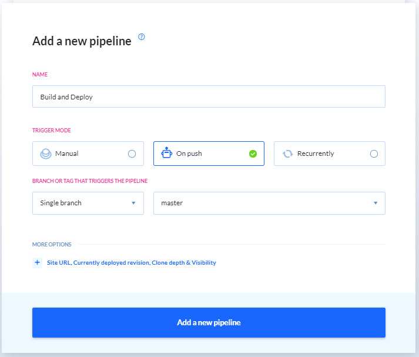
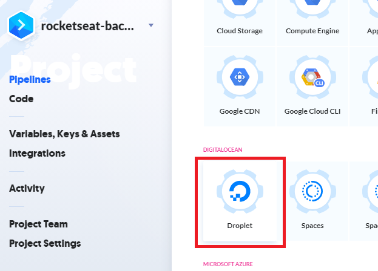
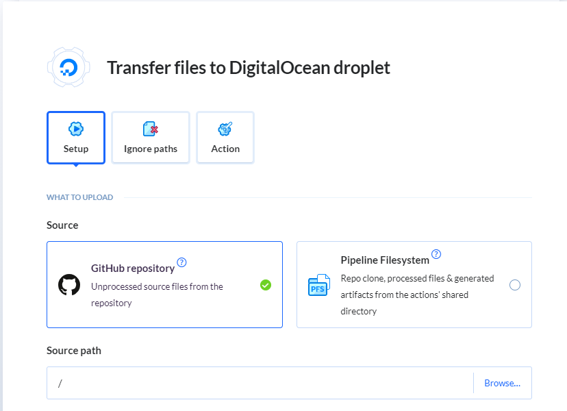
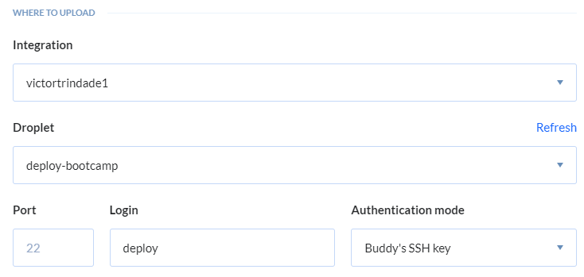
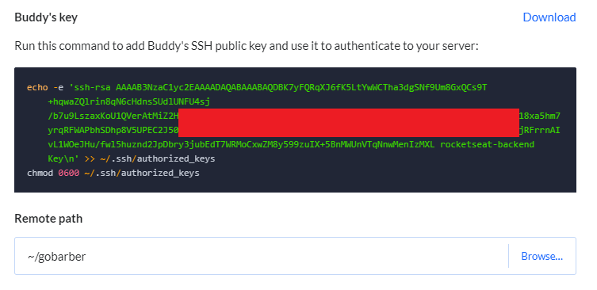
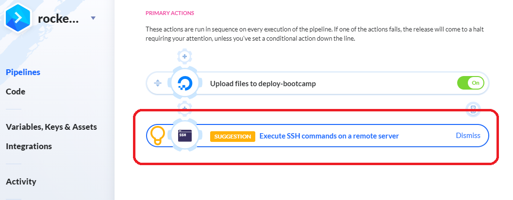
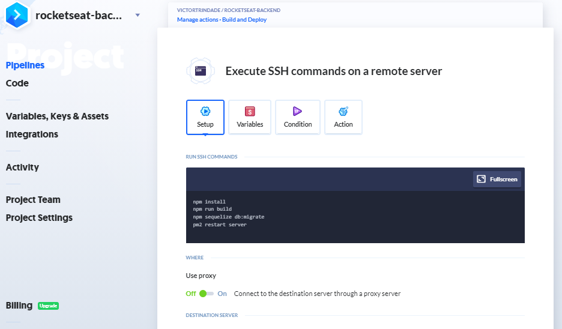
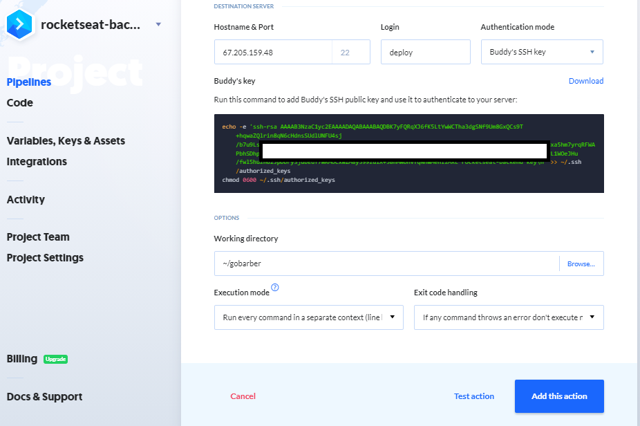
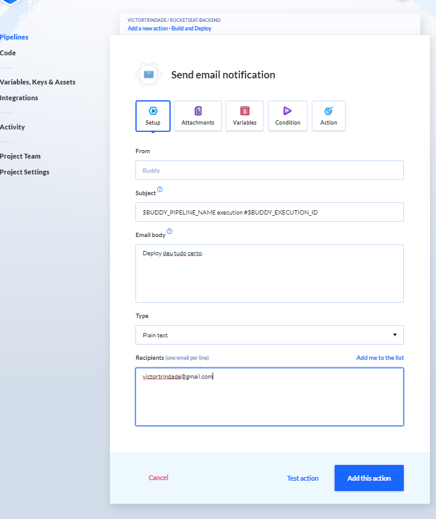
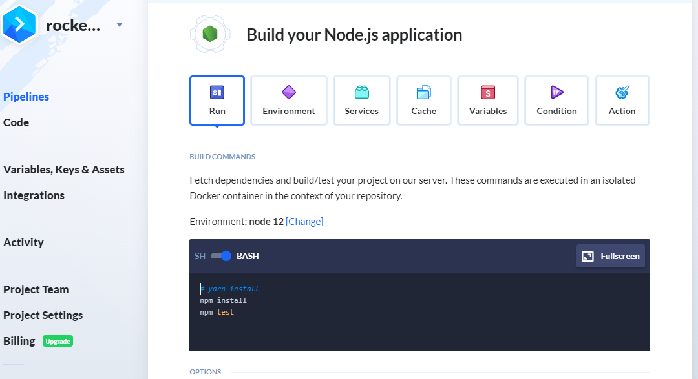

# Integração contínua

O código do branch master no github é necessariamente o principal. O caminho
correto num projeto é modificar por outros branchs e ao implementar no master,
este ser o definitivo. O que farei aqui é automatizar o deploy para toda vez que
subir o código pro github, já dar o deploy no servidor. Isto quer dizer q serão
executados:

  1. npm install. Garante instalação de qqr lib nova
  2. build do app
  3. migrations
  4. restart do servidor

Pra isso vou usar uma ferramenta chamada `Buddy`, q tem interface gráfica e é
bem fácil de mexer.

## Buddy.works

A Buddy é uma plataforma bem intuitiva. Crie um novo projeto. Vc verá q pode
escolher pegar o código do Github, Bitbucket, Gitlab, entre outros, ou até
mesmo pegar o código em servidor privado.

Escolha o repositório onde está o código.

### Pipeline

Adicione uma nova `pipeline`. As pipelines são como linhas do tempo, onde nelas
estão todos os comandos q vc quer executar em ordem.

O nome desta nova pipeline será "Build & Deploy". Marque a opção `On push` do
`Trigger Mode`.



#### Action - deploy ao commitar

Adicione uma nova action. Existem milhões disponíveis. Escolha
`Digital Ocean - Droplet`.



Abrirá uma tela com título *Transfer files to DigitalOcean droplet*

O Source path pode deixar `/` mesmo, pois assim pega todo o código.



Escolha sua conta da Digital Ocean e o droplet desejado.

A porta pode deixar 22 mesmo. O Login não se chama root, e sim `deploy`.



O `Authentication Mode`, vc pode clicar em `Buddy's SSH key`, q irá gerar na
tela uma nova SSH do Buddy com os comandos prontos pra instalar a SSH no server.
Basta copiar o código, e rodar no servidor.



O `remote path`, o professor colocou `~/app`, mas o meu app está em `~/gobarber`

Clique em `Add this Action`.

#### Action - comandos de build

A própria plataforma já recomenda adicionar a action *Execute SSH commands on a remote server*
ao criarmos a action do digital ocean. Adicione esta nova action.



Na tela *Execute SSH commands on a remote server*, onde tem o console, coloque
os comandos:

```bash
npm install
npm run build
npx sequelize db:migrate
pm2 restart server
```



No `Hostname & Port`, coloque o IP do servidor, e pode deixar a porta 22 mesmo.

No login, é `deploy`. Authentication mode `Buddy's SSH Key` (vai aparecer de
novo os comandos pra instalar a SSH no server. Não precisa repetir esse
comando).

No `Working directory`, o professor colocou `~/app`, mas o meu no server é
`~/gobarber`.



Adicione a nova action.

#### Action - notificar por e-mail o deploy

Adicione a action `Email` após a action de comandos no pipeline.

No *e-mail body*, se vc quiser vc pode colocar informações úteis, como tempo de demora pra executar as actions, etc. Eu só vou colocar uma msg qqr mesmo.

Em *Recipients*, coloque o e-mail q vc quer q chegue a msg.



#### Testando

Vou criar qqr edição no código, dar um commit e push, e ver a mágica acontecendo
na plataforma do Buddy.

##### src/routes.js

```diff
routes.post('/users', UserController.store);
routes.post('/sessions', SessionController.store);

+routes.get('/teste', (req, res) => res.send('ok'));

routes.use(authMiddleware);
```

`git add . && git commit -m "Teste Deploy automatico" && git push`

Pronto. É só ir no Buddy q vc verá os comandos sendo executados em tempo real!

Veja tb se o deploy foi. No browser, coloque a rota q vc criou:
`67.205.159.48/teste`

## Tests no Buddy

Dá pra executar testes de forma automática tbm. Não será feito no curso mas é
extremamente fácil. No `Buddy`, vc fará uma action de testes anterior às actions
de build. Vai criar uma action Node.js nessa action, com todos os passos iguais aos
feitos na configuração dos Testes de desenvolvimento. Dessa forma, o Buddy ganha
uma barreira de segurança onde só sobe real pra produção um app se ele tb passar
nos testes no Buddy.


